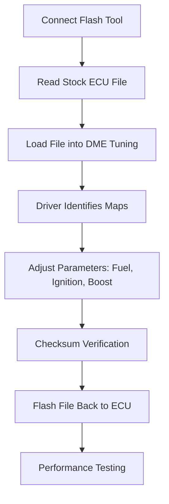

# DME Tuning – Professional ECU Remapping Tool

**DME Tuning** is a specialized software solution designed for advanced ECU calibration and engine optimization. Built for tuners, mechanics, and enthusiasts, it provides the tools to reconfigure **fuel maps, ignition timing, turbo boost, and torque limits** with unmatched accuracy.

With DME Tuning, you can transform a stock vehicle into a high-performance machine while maintaining safety and reliability.

[](#)
[](#)
[](#)
[](#)

---

## 🔎 Overview

The software bridges the gap between raw ECU data and practical performance adjustments. Instead of working with confusing hex values, DME Tuning translates engine parameters into clear maps and editable tables.

Its structured interface allows you to:

* Recognize critical engine maps instantly.
* Modify performance, fuel economy, or emissions balance.
* Flash optimized files safely back to the ECU.

---

## ✨ Key Features

* **Precision Map Editing:** Adjust torque, ignition, boost, and air/fuel ratios.
* **Live Data Logging:** Monitor RPM, pressure, and fuel trims in real time.
* **Multi-View Interface:** Switch between 2D curves, 3D surfaces, or raw HEX editing.
* **Automatic Checksum Correction:** Ensures safe ECU reprogramming.
* **Driver Library:** Pre-loaded templates for fast recognition of common ECUs.
* **Backup & Restore:** Protect against file corruption or failed flashes.

---

## 🖥 Compatibility

DME Tuning supports a wide range of ECUs and vehicles, from daily drivers to performance cars.

| Vehicle Type | ECU Brands                             | Notes                     |
| ------------ | -------------------------------------- | ------------------------- |
| Cars         | Bosch, Siemens, Delphi, Marelli, Denso | Petrol & Diesel supported |
| Motorcycles  | Keihin, Mitsubishi, Bosch              | Street & racing bikes     |
| Trucks       | Bosch, Cummins, Delphi                 | Commercial applications   |
| Agriculture  | Magneti Marelli, Siemens, Bosch        | Tractors & machinery      |

\[!IMPORTANT]
DME Tuning integrates with leading OBD and bench flashing tools (KESS, KTAG, CMD, Autotuner) for seamless ECU access.

---

## ⚡ Setup & Usage

Installing and using DME Tuning is straightforward:

1. Install the DME Tuning software on your Windows PC.
2. Connect your preferred flashing tool to the ECU via OBD/bench.
3. Read the stock ECU file and load it into DME Tuning.
4. Choose the appropriate **Driver** to identify maps automatically.
5. Edit values (fuel, torque, boost) in your preferred view.
6. Save and flash the modified file back to the ECU.

Example parameter changes:

```plaintext
Boost Pressure: +200 mbar
Ignition Timing: +3°
Torque Limiter: 480 Nm → 530 Nm
Lambda Target: 1.00 → 0.95
```

---

## 📊 Workflow Diagram



---

## ❓ FAQ

**Q: Does DME Tuning require prior tuning knowledge?**
A: While the software is intuitive, basic understanding of ECU parameters is recommended.

**Q: Can I brick my ECU with wrong settings?**
A: If incorrect values are applied, risks exist. Always create backups and test gradually.

**Q: Is internet connection mandatory?**
A: No, but online access ensures updated drivers and map templates.

**Q: Does DME Tuning support custom projects?**
A: Yes, you can create and save your own driver definitions for rare ECUs.

---

## 🚀 Final Thoughts

**DME Tuning software** is built for those who want professional control over ECU parameters without the complexity of raw code editing. Its map recognition, real-time logging, and built-in safety measures make it a trusted tool for workshops and tuning specialists worldwide.

